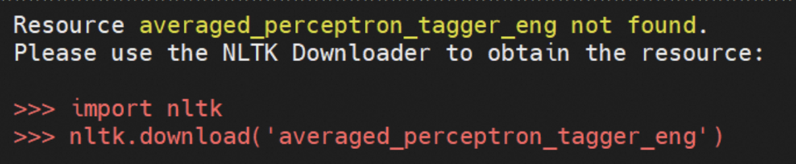

# 数字人对话demo
实时语音交互数字人，支持端到端语音方案（GLM-4-Voice - THG）和级联方案（ASR-LLM-TTS-THG）。可自定义形象与音色，支持音色克隆，首包延迟低至3s。

在线demo：https://www.modelscope.cn/studios/AI-ModelScope/video_chat

详细的技术介绍请看[这篇文章](https://mp.weixin.qq.com/s/jpoB8O2IyjhXeAWNWnAj7A)

**中文简体** | [**English**](./docs/README_en.md)

## TODO
- [x] TTS模块添加音色克隆功能
- [x] TTS模块添加edge-tts
- [x] LLM模块添加qwen本地推理
- [x] 支持GLM-4-Voice，提供ASR-LLM-TTS-THG和MLLM-THG两种生成方式
- [ ] 提供Docker镜像
- [ ] 集成[gradio-webrtc](https://github.com/freddyaboulton/gradio-webrtc)（需等待支持音视频同步），提高视频流稳定性
 
## 技术选型
* ASR (Automatic Speech Recognition): [FunASR](https://github.com/modelscope/FunASR)
* LLM (Large Language Model): [Qwen](https://github.com/QwenLM/Qwen)
* End-to-end MLLM (Multimodal Large Language Model): [GLM-4-Voice](https://github.com/THUDM/GLM-4-Voice/tree/main)
* TTS (Text to speech): [GPT-SoVITS](https://github.com/RVC-Boss/GPT-SoVITS), [CosyVoice](https://github.com/FunAudioLLM/CosyVoice), [edge-tts](https://github.com/rany2/edge-tts)
* THG (Talking Head Generation): [MuseTalk](https://github.com/TMElyralab/MuseTalk/tree/main)


## 本地部署
### 0. 显存需求
* 级联方案(ASR-LLM-TTS-THG)：约8G

* 端到端语音方案(MLLM-THG)：约20G
  
对于不需要使用端到端 MLLM 的开发者，可以选择仅包含级联方案的`cascade_only`分支。
```bash
$ git checkout cascade_only
```

### 1. 环境配置

* ubuntu 22.04
* python 3.10
* CUDA 12.2
* torch 2.1.2

```bash
$ git lfs install
$ git clone https://www.modelscope.cn/studios/AI-ModelScope/video_chat.git
$ conda create -n metahuman python=3.10
$ conda activate metahuman
$ cd video_chat
$ pip install -r requirement.txt
# $ pip install --upgrade gradio # 安装Gradio 5（可选）
```

### 2. 权重下载
#### 2.1 创空间下载（推荐）
创空间仓库已设置`git lfs`追踪权重文件，如果是通过`git clone https://www.modelscope.cn/studios/AI-ModelScope/video_chat.git`克隆，则无需额外配置

#### 2.2 手动下载
##### 2.2.1 MuseTalk

参考[这个链接](https://github.com/TMElyralab/MuseTalk/blob/main/README.md#download-weights)

目录如下：
``` plaintext
./weights/
├── dwpose
│   └── dw-ll_ucoco_384.pth
├── face-parse-bisent
│   ├── 79999_iter.pth
│   └── resnet18-5c106cde.pth
├── musetalk
│   ├── musetalk.json
│   └── pytorch_model.bin
├── sd-vae-ft-mse
│   ├── config.json
│   └── diffusion_pytorch_model.bin
└── whisper
    └── tiny.pt
```
##### 2.2.2 GPT-SoVITS

参考[这个链接](https://github.com/RVC-Boss/GPT-SoVITS/blob/main/docs/cn/README.md#%E9%A2%84%E8%AE%AD%E7%BB%83%E6%A8%A1%E5%9E%8B)

##### 2.2.3 GLM-4-Voice
在`app.py`中添加如下代码即可完成下载。
```python
from modelscope import snapshot_download
snapshot_download('ZhipuAI/glm-4-voice-tokenizer',cache_dir='./weights')
snapshot_download('ZhipuAI/glm-4-voice-decoder',cache_dir='./weights')
snapshot_download('ZhipuAI/glm-4-voice-9b',cache_dir='./weights')
```

### 3. 其他配置
LLM模块和TTS模块提供了多种方式，可自行选择推理方式
#### 3.1 使用API-KEY（默认）
对于LLM模块和TTS模块，如果本地机器性能有限，可使用阿里云大模型服务平台百炼提供的[Qwen API](https://help.aliyun.com/zh/dashscope/developer-reference/tongyi-thousand-questions/?spm=a2c4g.11186623.0.0.581423edryZ54Q)和[CosyVoice API](https://help.aliyun.com/zh/dashscope/developer-reference/cosyvoice-large-model-for-speech-synthesis/?spm=a2c4g.11186623.0.0.79ce23ednMIj9m)，请在app.py(line 14)中配置API-KEY。

参考[这个链接](https://help.aliyun.com/zh/dashscope/developer-reference/acquisition-and-configuration-of-api-key?spm=a2c4g.11186623.0.0.7b7344b7jkORJj)完成API-KEY的获取与配置。

```python
os.environ["DASHSCOPE_API_KEY"] = "INPUT YOUR API-KEY HERE"
```

#### 3.2 不使用API-KEY 
如果不使用API-KEY，请参考以下说明修改相关代码。
##### 3.2.1 LLM模块
`src/llm.py`中提供了`Qwen`和`Qwen_API`两个类分别处理本地推理和调用API。若不使用API-KEY，有以下两种方式进行本地推理：
1. 使用`Qwen`完成本地推理。
2. `Qwen_API`默认调用API完成推理，若不使用API-KEY，还可以使用`vLLM`在本地部署模型推理服务，参考[这个链接](https://qwen.readthedocs.io/zh-cn/latest/getting_started/quickstart.html#vllm-for-deployment)完成部署后，使用`Qwen_API(api_key="EMPTY",base_url="http://localhost:8000/v1")`初始化实例调用本地推理服务。

##### 3.2.2 TTS模块
`src/tts.py`中提供了`GPT_SoVits_TTS`和`CosyVoice_API`分别处理本地推理和调用API。若不使用API-KEY，可直接删除`CosyVoice_API`相关的内容，使用`Edge_TTS`调用Edge浏览器的免费TTS服务进行推理。

### 4. 启动服务

```bash
$ python app.py
```
### 5. 使用自定义的数字人形象（可选）
1. 在`/data/video/`中添加录制好的数字人形象视频
2. 修改`/src/thg.py`中`Muse_Talk`类的`avatar_list`，加入`(形象名, bbox_shfit)`，关于bbox_shift的说明参考[这个链接](https://github.com/TMElyralab/MuseTalk?tab=readme-ov-file#use-of-bbox_shift-to-have-adjustable-results)
3. 在`/app.py`中Gradio的avatar_name中加入数字人形象名后重新启动服务，等待完成初始化即可。

### 6. 已知问题
1. 报错无法找到某资源：按照报错提示下载对应的资源即可


2. 右侧视频流播放卡顿：需等待Gradio优化Video Streaming效果
3. 与模型加载相关：检查权重是否下载完整